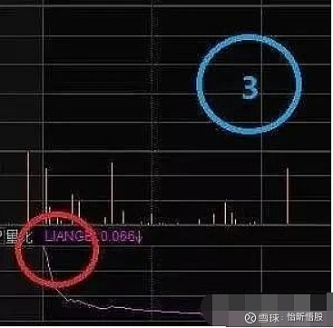

## 量比

- 量比为0.8-1.5倍，则说明成交量处于正常水平
- 量比在1.5-2.5倍之间则为温和放量，如果股价也处于温和缓升状态，则升势相对健康，可继续持股，若股价下跌，则可认定跌势难以在短期内结束，从量的方面判断应可考虑停损退出
- 量比在2.5-5倍，则为明显放量，若股价相应地突破重要支撑或阻力位置，则突破有效的几率颇高，可以相应地采取行动
- 当量比达到5-10之间的时候，这就是放天量了，如果出现在低位，说明主力在吸筹，反之，在高位，则代表着主力大概率是在出逃，短期见顶的可能就很大了
- 量比在0.5倍以下的，是严重缩量。不仅显示了交易不活跃的表象，同时也暗藏着一定的市场机会。缩量创新高的股票多数是长庄股，缩量能创出新高，说明庄家控盘程度相当高，而且可以排除拉高出货的可能
- 如果量比数值极度缩小，到了0.5以下，那么不管是高位还是低位，将会是大好事，说明高位人气不足，无人接盘，还要拉升吸引人气接盘，而低位说明无人买卖，再跌下去意义不大，不如拉升给人解套吸筹

> - 量比临界点:量比数值在1倍左右时，是一个临界点，也就是说近期成交量平衡，此时也是最容易发生变盘的时候，在盘中会有以下三种情况出现
>
>> 1. 量比由极小状态放大，向上突破1倍的量比值，分时线配合理想，择机介入
>> 2. 量比数值由几倍的数值下降到一倍以下以后，股价反而产生高点，此时，量比却小于一倍以下，而个股的量能及分时线形态出现问题，则说明主力已无心上攻，股价呈现弱势，择机卖出
>> 3. 如果量比数值下降后，有时会在一倍左右运行，大约在0.9倍以上运行，股价放量上涨，分时线配合理想，可以择机买入
>>

###### 量比的实际应用

> 1. 量比指标趋势向上时可以卖股票，直到曲线转头向下。
>
>> 
>>

> 2. 量比指标趋势向下，买入须谨慎，短线爱好者尽量回避。
>
>> 
>>

> 3. 股价涨停，量比曲线最好迅速拐头向下。涨停板量比曲线趋势向上，提防可能有获利盘出逃。
>
>> 
>>

> 4. 股价上涨、量比曲线趋势向上，双线向上说明股价上涨有量能的支撑，可以积极买入或持股。
>
>> 
>>

> 5. 股价下跌、量比曲线趋势依旧向上，很可能就是放量下跌，可以考虑尽快减持或离场。
>
>> 
>>

> 6. 短线操作中，股价首次放量上涨，量比指标不宜超过“5”;股价连续放量上涨，量比指标不宜超过“3”，否则需要提防主力出逃。
>
>> 
>>

###### 好用的几种量比指标

> 1. 高开大量比：股票在开盘时，高开3%以上：量比20以上，量比越大越好。一个股票的大幅高开，已经说明主力是有备而来，大的量比，是今天大幅放量的开始。这样的股票当天肯定是大涨或者涨停。可以在开盘时的涨幅榜上面进行选择、跟踪。一般应该在上冲后回调时买入。假如5%时能够买入，当天的盈利加上第2天冲高或者继续涨停，2天的盈利非常可观。第2天的操作原则是只要不涨停，就在高点卖出。
>
>> 
>>

> 2. 大幅低开无好股：一个股票在平稳的走势或者是在下跌过程中某一天突然大幅低开，说明这一个股票即将加速下跌。尤其是在破位之时，股票的向下跳空，是前一天主力痛定思痛，坚决卖出的操作行为。大盘的大幅低开与股票的大幅低开形成原理基本相同。在此时此刻，第一时间卖出大幅低开的持股，是唯一的操作。次去股价将一路快速下跌。
>
>> 
>>

> 3. 长上影线后的第2天：长上影线在k线中称为射击之星，尤其在高位出现时，第2天下跌的概率较大，高位长上影线后的下跌往往会引发下跌破位的走势，而股价一旦破位，将是一个绵绵无期的下跌路程。当发现手中的股票在高位出现长上影线时，应当在当天收盘前卖出。如果当天没有卖出的，第2天冲高时一定要坚决卖出。
>
>> 
>>

---

---

## 换手率

```
换手率的高低代表着股票的活跃程度，高换手率也就是大于5%，说明这只个股有活跃度，买的人多，卖的人也多，低换手率也就是小于3%，则反之。这里总结了四种不同情况的换手率的应对方法
```

- 低位高换手，这种情况的出现就代表着主力在底部悄悄地吸筹，未来大概率有戏，适合中线低吸，和主力一起建仓埋伏
- 高位高换手，这就是多家主力在高位出现了多空分歧的表现，有的主力则不断在看多进场，有的则不断地看空出逃，一般这种情况会出现在大龙头和妖股的上涨途中，像这种神仙打架，小散们先离远点，小心别伤着自己，先观察，看哪一方能最终打赢，谁打赢了你跟谁
- 高位低换手，一般这种情况就是涨不动的表现，上涨无力没有新的资金进场参与，这个时候就要特别注意风险了，谨慎入场
- 低位低换手，这种多数出现在股价连绵不断的下跌的趋势里，不值得去关注，也不值得去做

---

---

## 内外盘

```
 内盘就是主动性卖盘，外盘就是主动型买盘。内外盘的数值大小就是多空博弈的力量体现
```

- 外>内，同时量价齐升，高看一线，内>外，同时放量下跌，果断离场
- 外>内，同时股价不涨反跌，如果是在高位，就是在出货了，内>外，同时股价不跌反而上涨，低位吸筹
- 内外盘数值都很小，同时股价小幅上涨，说明主力已经锁定筹码，等待时机拉升
